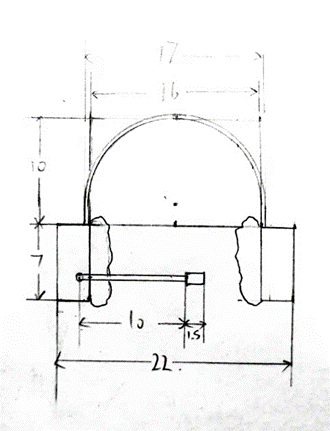

### Design title:

Head-mounted multifunctional terminal

### Design purpose:

According to WTO statistics, there are about 1 billion disabled people in the world, and 200 million of them have serious physical defects. The disabled are far more than we thought. Some disabled or elderly people cannot control electrical appliances or switch lights by themselves, so they can use this device. Normal people can also use it.

### The main function:
1. Internet of Things voice control terminal (similar to audio)
2. Make/receive calls
3. It can be used as earphone and microphone for voice recognition
4. Translation from time to time
5. Call for help

### Technical support - speech recognition technology:

Speech recognition technology, also known as automatic speech recognition, aims to convert the vocabulary content of human speech into computer-readable input, such as keystrokes, binary codes, or character sequences. Different from speaker recognition and speaker verification, the latter tries to recognize or confirm the speaker who made the speech instead of the vocabulary content contained therein.

&nbsp;

### Equipment structure:

The main structure is like a headset, which can be worn on the head.
- Speaker
- Motherboard (provide system and basic computing support)
- Condenser microphone (collect external audio and user's voice as the main input channel)
- Network card and antenna (can be connected to local mobile network and WLAN network)
- Bluetooth module (connected with smart phones and other terminals)
- Phone card
- GPS module

### Specific design:

- When a wake word is detected, it wakes and collects audio, then responds to the user's instructions (such as turning on electrical appliances, etc.)
- Make a call when the user says it is required to make a call
- Remind users when there is an incoming call
- Can be used as a headset when connected to Bluetooth
- Start real-time translation when users say they need real-time translation services
- When the user speaks an emergency call for help, it will automatically send location information and call the police (considering that the user may be disabled)