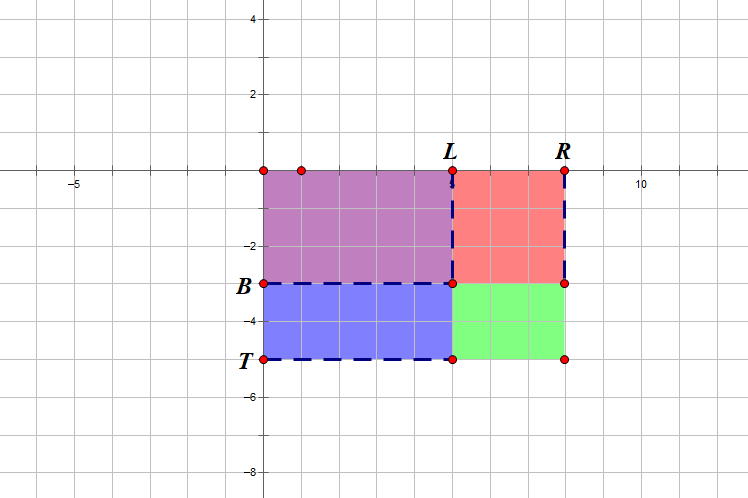

## 关于边界问题的处理

树状数组无法处理第0位，会陷入死循环，而写二维树状数组的题目时题目中却要考虑到0，导致死循环并运行超时。边界问题的处理是很重要的一环。

本题最初的思考存在以下问题：
1. 坐标解读的问题

如下图所示，最初将坐标点的位置解读为图中框中，而不是交叉点上，坐标系中，坐标的位置应该在交叉点上，每一个坐标点可以有属于自己的值。通常通过一个函数来定义，比如：

$$f(x,y)=ax+by+c$$



2. 坐标值的问题

在坐标系中，原点的坐标是$(0,0)$。所以，需要注意代码中坐标的下标值要从0开始，而不是从1开始。

由于树状数组在计算以下函数时：
```cpp
int lowbit(int x){return x&-x;}
```
如果$x=0$，则lowbit的值是0。会导致函数$add()$和$query()$进入死循环，从而导致问题。

3. 问题解决办法
因此，为了避免上述问题，采用将坐标值整体加1，由于最终输出与坐标值无关，因此能解决此问题。体现在main函数的以下两行中：

```cpp
add(x+1,y+1,c);
```

和

```cpp
cout<<query(r+1,y+1)-query(r+1,x)-query(l,y+1)+query(l,x)<<endl;
```

```cpp
int main(){
	while(true){
		cin>>op;
		if(op==0){
			cin>>n;
		}else if(op==1){
			cin>>x>>y>>c;
			add(x+1,y+1,c);
		}
		else if(op==2){
			cin>>l>>x>>r>>y;
			cout<<query(r+1,y+1)-query(r+1,x)-query(l,y+1)+query(l,x)<<endl;
		}else{
			break;
		}
	}
	return 0;
}
```

4. 优化解决方案

由于将坐标值整体加1，可能会导致最终坐标不正确，比较好的解决办法是通过边界值单独处理。
