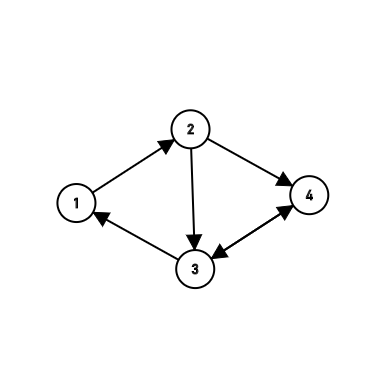

### Path
pre:
$$F[\{p\}][p]=\texttt{true}(p\in V)$$
end:
$$\bigvee_{t\in V}F[V][t]$$

### Circle
pre:
$$F[\phi][1]=\texttt{true}$$
end:
$$F[V][1]$$

-----


<details>
  <summary>Code</summary>

```
#include "bits/stdc++.h"
using namespace std;
const int N=1<<20;
int n,m,e[25][25];
bool dp[N][25];//dp[i][j]表示状态为i，最后到达j点有没有路径
int g[N][25];
int main(){
    cin>>n>>m;
    for(int i=1;i<=m;i++){
        int u,v;
        cin>>u>>v;
        e[u][v]=true;
    }
    dp[1][1]=true;
    for(int s=1;s<(1<<n);++s){
        for(int p=1;p<=n;++p){
            if(s&(1<<(p-1))==0)continue;//判断p是否为S中元素
            for(int q=1;q<=n;++q){
                if(s&(1<<(q-1))==0)continue;//判断q是否为S中元素
                if(!e[q][p])continue;//判断有没有q到p的边
                if(dp[s^(1<<(p-1))][q]){//判断dp[{s}-p][q]是否为真
                    dp[s][p]=true;
                    g[s][p]=q;
                }
            }
        }
    }
    int s=(1<<n)-1;
    bool flag=0;
    stack<int>output;
    for(int i=1;i<=n;i++){
        if(dp[s][i]&&e[i][1]){
            int p=i;
            output.push(p);
            do{
                output.push(g[s][p]);
                int t=p;
                p=g[s][p];
                s-=(1<<(t-1));
            }while(s!=1);
					flag=1;
            break;
        }
    }
	if(!flag){
		cout<<"No Answer"<<endl;
		return 0;
	}
    while(!output.empty()){
        cout<<output.top()<<' ';
        output.pop();
    }
    return 0;
}
```
</details>

<details>
  <summary>Test</summary>

```
3 3
1 2
2 3
3 1
```
```cpp
dp[1][1]=1;//{0,0,1}

dp[3][2]=1;//{0,1,1}
g=1;

dp[7][3]=1;//{1,1,1}
g=2;
```
----
```
5 5
1 3
3 4
4 2
2 5
5 1
```
```cpp
dp[1][1]=1;//{0,0,0,0,1}

dp[5][3]=1;//{0,0,1,0,1}
g=1;

dp[13][4]=1;//{0,1,1,0,1}
g=3;

dp[15][2]=1;//{0,1,1,1,1}
g=4;

dp[31][5]=1;//{1,1,1,1,1}
g=2;
```
----
```
4 6
1 2
2 3
2 4
3 1
3 4
4 3
```

```cpp

```
----
```
6 9
1 4
1 5
2 3
2 4
4 5
3 1
4 6
6 2
5 4
```
----

```
10 20
1 2
2 3
3 4
4 5
5 6
6 7
7 8
8 9
9 10
10 1
1 3
3 8
8 10
5 10
3 5
6 1
7 3
4 1
10 2
8 1
```

</details>

总结：
- 然后出现了数据大小问题，因为数据量太大，用内存调试会卡死，所以用输出调试的方法解决了
- 第一次的问题出现在g的记录和输出的边界，和g记录的内容的用处，g是为了回溯时记录上一个点
- 最后解决了无解的情况，要输出"No Answer"，还有1的特判，要求最后的点能够到达1

调试过程中应该，
比如在有疑问的位置，得出结果的时候即时输出，还有不用内存调试，这样看到的只是瞬时状态，看不到全局状态，容易漏掉东西

