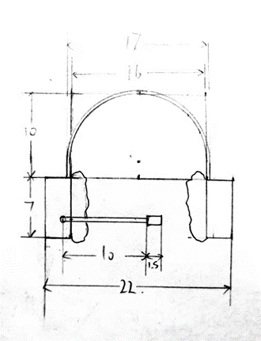

### 设计名称：
头戴式多功能终端

### 设计目的：
据WTO统计，全球约有10亿残障人群，其中两亿人身体上有很大缺陷，可见残障人士远比我们想象得多。有一些手脚不方便的残疾人或老年人无法自己操控电器或开关灯，可以使用此设备。正常人也可以使用。

### 主要功能：
1. 物联网语音控制终端（类似音响）
2. 拨打/接收电话
3. 作为耳机和麦克风使用，可进行语音识别
4. 时时翻译
5. 紧急呼救

### 技术支持：语音识别技术
语音识别技术，也被称为自动语音识别，其目标是将人类的语音中的词汇内容转换为计算机可读的输入，例如按键、二进制编码或者字符序列。与说话人识别及说话人确认不同，后者尝试识别或确认发出语音的说话人而非其中所包含的词汇内容。

### 设备结构：
- 主体结构类似头戴式耳机，可以带在头上
- 扬声器
- 主板（提供系统和基础计算支持）
- 电容话筒（采集外界音频和用户的语音，作为主要输入途径）
- 网卡和天线（可以接入本地移动网络和WLAN网络）
- 蓝牙模块（和智能手机以及其它终端连接）
- 电话卡
- 卫星定位模块

### 具体设计：
- 当检测到某个唤醒词的时候，被唤醒并采集音频，对用户的指令做出相应的回应（如打开电器等）
- 当用户说要求拨打电话时拨打电话
- 当有来电时提醒用户
- 当连接蓝牙时可作耳机
- 当用户说需要实时翻译服务时启动实时翻译
- 当用户说出紧急呼救时自动发送位置信息并报警（考虑到使用人群可能行动不便）

